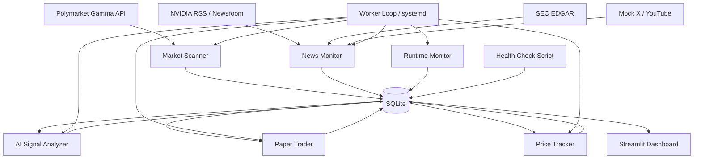

# 系统架构说明

系统采用单机 Python 架构，适合第一阶段 MVP 和后续迁移。定时任务由 `src.main loop` 或外部 cron/systemd 调度，数据统一写入 SQLite。仪表盘使用 Streamlit 读取同一数据库。

| 组件 | 文件 | 说明 |
| --- | --- | --- |
| 配置加载 | `src/config_loader.py` | 读取 YAML 与 `.env` |
| 数据库 | `src/database.py` | 定义 SQLite / SQLAlchemy 表结构 |
| 盘口扫描 | `src/market_scanner.py` | 调用 Polymarket Gamma API，关键词过滤 NVIDIA 盘口 |
| 盘口评分 | `src/market_ranker.py` | 启发式评分并生成 A/B/C/D 等级 |
| 信息源 | `src/sources/*` | RSS、SEC、mock X、mock YouTube 统一输出消息对象 |
| AI 分析 | `src/ai_signal.py` | 默认启发式，可启用 OpenAI JSON 输出 |
| 纸面交易 | `src/paper_trader.py` | 按信号创建模拟交易记录，加入置信度、影响分、账户风险预算和去重约束 |
| 价格跟踪 | `src/price_tracker.py` | 维护价格快照、未实现盈亏、止损止盈和交易追踪窗口 |
| 运行监控 | `src/runtime_monitor.py` | 记录每次后台循环运行状态、耗时、结果 JSON 与错误消息 |
| 后台 worker | `scripts/run_worker.sh` / `deploy/polymarket-nvidia-event-radar.service` | 提供可持续运行入口和 systemd 自恢复模板 |
| 健康检查 | `scripts/health_check.py` | 输出数据库状态、最近运行记录和健康状态 JSON |
| 仪表盘 | `app/dashboard.py` | 展示市场、消息、信号、交易与同步状态 |

长期运行不建议依赖临时会话。实际 30 天验证应部署在本机、云服务器或其他能持续运行 Python 进程的环境中。核心增强版提供两类运行方式：开发时可以直接执行 `python -m src.main loop --config config/config.yaml`；生产式验证建议使用 `scripts/run_worker.sh` 作为进程入口，并用 `deploy/polymarket-nvidia-event-radar.service` 交给 systemd 托管。后台循环发生异常时会写入 `runtime_runs` 和 `system_logs`，并按配置执行指数退避。
