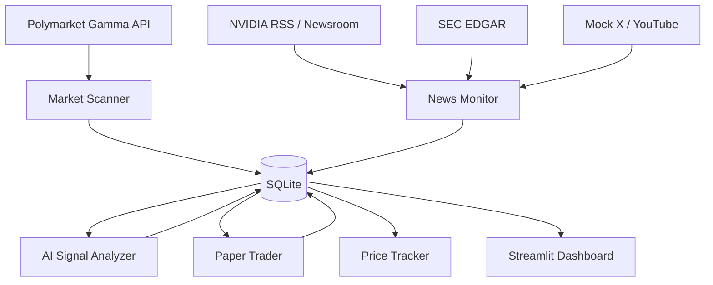

# 系统架构说明

系统采用单机 Python 架构，适合第一阶段 MVP 和后续迁移。定时任务由 `src.main loop` 或外部 cron/systemd 调度，数据统一写入 SQLite。仪表盘使用 Streamlit 读取同一数据库。

| 组件 | 文件 | 说明 |
| --- | --- | --- |
| 配置加载 | `src/config_loader.py` | 读取 YAML 与 `.env` |
| 数据库 | `src/database.py` | 定义 SQLite / SQLAlchemy 表结构 |
| 盘口扫描 | `src/market_scanner.py` | 调用 Polymarket Gamma API，关键词过滤 NVIDIA 盘口 |
| 盘口评分 | `src/market_ranker.py` | 启发式评分并生成 A/B/C/D 等级 |
| 信息源 | `src/sources/*` | RSS、SEC、mock X、mock YouTube 统一输出消息对象 |
| AI 分析 | `src/ai_signal.py` | 默认启发式，可启用 OpenAI JSON 输出 |
| 纸面交易 | `src/paper_trader.py` | 按信号创建模拟交易记录 |
| 价格跟踪 | `src/price_tracker.py` | 维护价格快照和纸面交易追踪窗口 |
| 仪表盘 | `app/dashboard.py` | 展示市场、消息、信号、交易与同步状态 |

长期运行不建议依赖临时会话。实际 30 天验证应部署在本机、云服务器或其他能持续运行 Python 进程的环境中。
